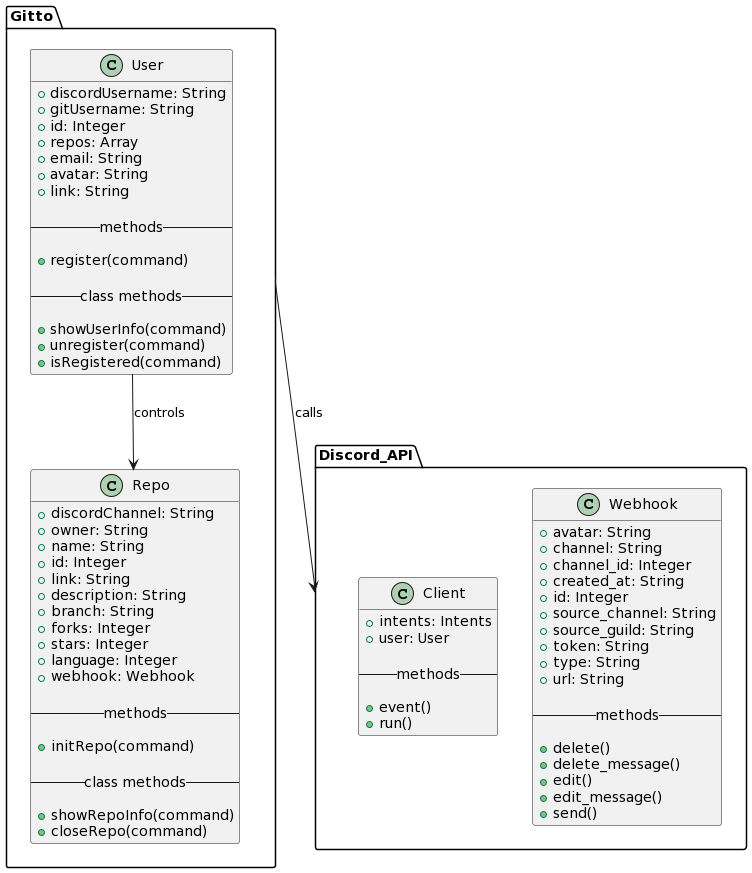

<div align='center'>


# Gitto

[](https://discordpy.readthedocs.io/en/stable/)
[](https://github.com/Zhunder69)
[](https://replit.com/@Zhunder/gitto#main.py)

Un bot de Discord para vigilar proyectos de Github en Discord
</div>

## Requisitos funcionales

1. Identificarse como un usuario de Github.
2. Abrir un repositorio en un canal de texto en especifico.
3. Consultar informacion acerca de los usuarios y repositorios activos.
4. Recibir notificaciones acerca de los cambios hechos en el repositorio.

## Diagrama de clases

<div align='center'>


</div>

## Replit

Para probar el bot, puede dirigirse a este [enlace](https://replit.com/@Zhunder/gitto#main.py). Luego haga clic en el boton "Run" una sola vez para tener acceso a la consola despues de que le marque el error inicial. Copie y pegue el siguiente comando:

``` python
import os; os.putenv("GITTO_TOKEN", "MTA0MTQ0NTg1OTE4NDg2OTM5Ng.GZ1d13.BdSBBgAuNc3Jjw3hu3ZBzOKAsrdyDhX7P904C0"); os.system("python main.py")
```

Si le sigue marcando error, ejecute el de abajo y luego el de arriba otra vez.

``` python
os.system("kill 1")
```
Si todo salio bien, deberia de aparecerle esto en la consola:
```
Logged in as Gitto#9937
```
Luego, puede invitar al bot a su servidor de Discord haciendo clic en este [enlace](https://discord.com/api/oauth2/authorize?client_id=1041445859184869396&permissions=407619370048&scope=bot).